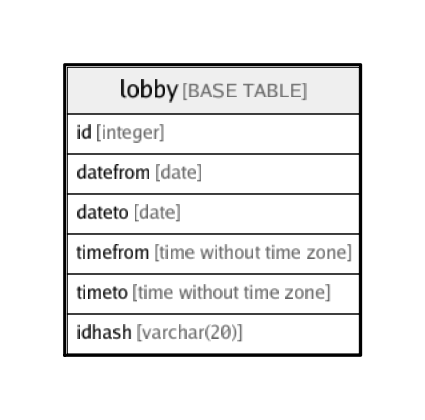

# lobby

## Description

## Columns

| Name | Type | Default | Nullable | Children | Parents | Comment |
| ---- | ---- | ------- | -------- | -------- | ------- | ------- |
| id | integer | nextval('lobby_id_seq'::regclass) | false |  |  |  |
| datefrom | date |  | true |  |  |  |
| dateto | date |  | true |  |  |  |
| timefrom | time without time zone |  | true |  |  |  |
| timeto | time without time zone |  | true |  |  |  |
| idhash | varchar(20) |  | true |  |  |  |

## Relations

---

> Generated by [tbls](https://github.com/k1LoW/tbls)
