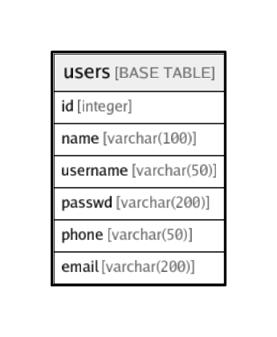

# users

## Description

## Columns

| Name | Type | Default | Nullable | Children | Parents | Comment |
| ---- | ---- | ------- | -------- | -------- | ------- | ------- |
| id | integer | nextval('users_id_seq'::regclass) | false |  |  |  |
| name | varchar(100) |  | true |  |  |  |
| username | varchar(50) |  | true |  |  |  |
| passwd | varchar(200) |  | true |  |  |  |
| phone | varchar(50) |  | true |  |  |  |
| email | varchar(200) |  | true |  |  |  |

## Constraints

| Name | Type | Definition |
| ---- | ---- | ---------- |
| username_unique | UNIQUE | UNIQUE (username) |

## Indexes

| Name | Definition |
| ---- | ---------- |
| username_unique | CREATE UNIQUE INDEX username_unique ON public.users USING btree (username) |

## Relations

---

> Generated by [tbls](https://github.com/k1LoW/tbls)
